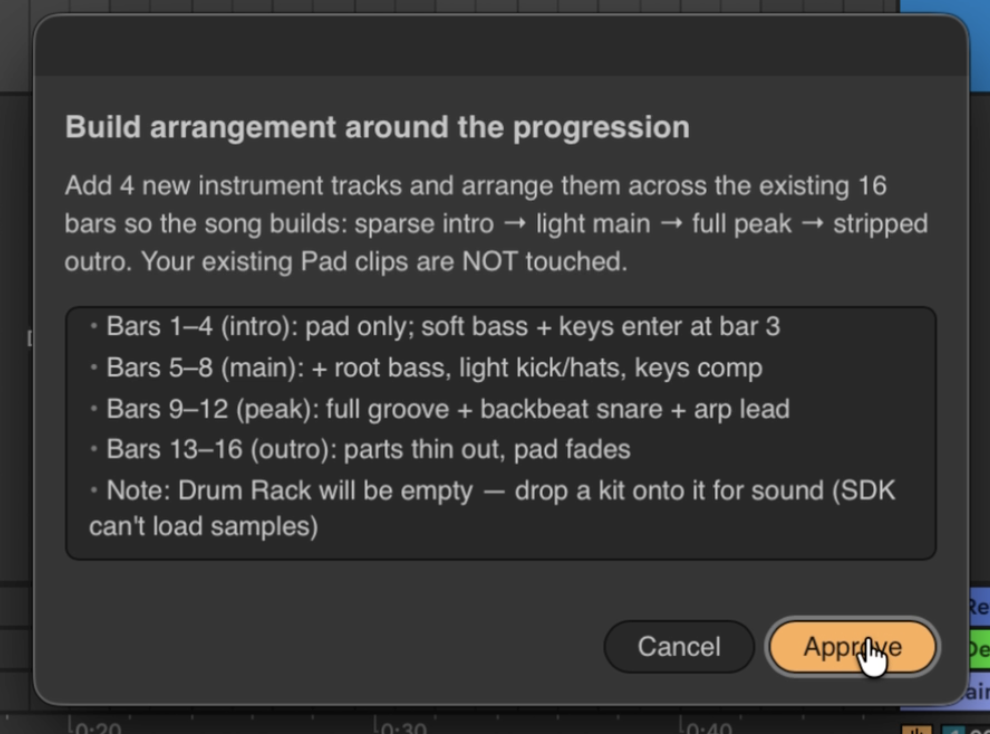

> Status: **v0.1 prototype**, work-in-progress...

# Ableton SDK - Model Context Protocol (MCP) Server

An **Ableton SDK MCP server** made via Ableton Extensions SDK + **Agent Skills** to allow AI coding agents operate Ableton Live 12, for long-running music production sessions.


> **Note:** Acknowledging several existing Ableton MCPs: [ableton-mcp](https://github.com/ahujasid/ableton-mcp), [extended](https://github.com/jon-wrennall/ableton-mcp-extended), [producer-pal](https://github.com/adamjmurray/producer-pal).  
This one is built with [Ableton Extensions SDK](https://www.ableton.com/en/live/extensions) and took a different approach: **allowing Claude Code directly execute TypeScript inside Live**, instead of hard-coding tools, so all operations supported by the SDK can be used by Claude Code.


This repository gives your AI coding agent the following resources:
 - **An Ableton Extension** with a Live UI for confirm/progress
 - **An MCP server** built with Ableton Extensions SDK 
 - **Knowledge skills** about Ableton + music-making expertise (work-in-progress)


## How it works

### MCP tools
The MCP exposes seven tools to Claude (all prefixed `ableton_`):

| Tool | What it does |
|------|-------------|
| `ableton_get_context` | Full project snapshot — tracks, clips, devices, mixer, scenes, tempo, key |
| `ableton_get_track` | Detail for one track (devices, clip slots, mixer) |
| `ableton_get_device` | All parameters of a device by name + current values |
| `ableton_get_clip_notes` | MIDI notes in a clip (pitch, startTime, duration, velocity) |
| `ableton_get_selection` | Whatever the user right-clicked → "Send to Agent" in Live |
| `ableton_render_audio` | Export a track's audio (pre-FX) as a WAV for analysis |
| `ableton_run_code` | **Execute JS/TS against the Extensions SDK inside Live** |

`ableton_run_code` is the action. The others are read-only perception tools.

### `run_code` — how JS/TS executes inside Live

When your coding agent calls `ableton_run_code`, the MCP sends the code over WebSocket to the
Ableton Extension. The extension:

1. **Transpiles** TypeScript to ES module output (via [Sucrase](https://github.com/alangpierce/sucrase)).
2. **Executes** via `new Function(…)` in a thin sandbox — globals like `fetch`, `require`,
   `process`, `eval` are shadowed/removed. 
3. **Returns** `{ result, logs, error, phase }` — `phase` is `"transpile"` / `"runtime"` /
   `"timeout"` for debug.

## Prerequisites
- **Ableton Live 12.4.5 public beta** (tested against 12 Beta) with **Developer Mode** on
  (Live → Settings → Extensions) — required to dev-run the extension.
- **Node ≥ 24**.
- **Claude Code**, not Claude, as this MCP is targeted for coding agents.

## Setup
```bash
npm run setup      # installs + builds the extension and the MCP bridge
```

## Run
This repo is work-in-progress, so please build `.ablx` and load agent skills manually:

### Have extension running inside Live:

**A) Dev-run the extension** (simplest during development):
```bash
cd kernel && npm start -- --live "/Applications/Ableton Live 12 Beta.app"
```

or 

**B) Or install it as an extension** (no dev mode needed by the end user):
```bash
npm run package    # builds kernel/…ablx
# then drag the .ablx onto  Live → Settings → Extensions
```
Either way the extension listens on `ws://127.0.0.1:17890`.

### Connect Claude Code 
Open Claude Code in this directory — it loads the bundled
`.mcp.json` (server `abletonsdk`). If the relative path doesn't resolve in your setup:
```bash
claude mcp add abletonsdk -- node "$PWD/abletonsdk-mcp-server/dist/index.js"
```
Approve the server, then the `ableton_*` tools + the skills are available.

## Usage
With Live open and the extension running, ask Claude things like:
- *"Make an 8-bar house loop"* → the **ableton-playbooks** skill builds drums + bass +
  chords + lead in key, with instruments and a rough mix (one Cmd-Z undoes it).
- *"Write a IV–V–vi progression in D minor on a new track"* → **ableton-midi** + **music-strategies**.
- *"Add a warm pad with Operator and a reverb send"* → **ableton-sound-design** + **ableton-mixing**.
- Select clips/tracks in Live → right-click **"Send to Agent"**, then ask Claude about *"the selection"*.

Every edit triggers an **in-Live confirmation dialog** before it runs; long work shows a
**progress bar**. The agent reports what changed and that **Cmd-Z** reverts it.

</img>

## Limitations
 - built-in Live devices only (VST/AU or preset loading are not allowed by the SDK)
 - no automation / clip envelopes (not allowed by the SDK) 
 - no transport/playback control (not allowed by the SDK) 
 - clip length/loop fixed at creation (modifying them is not allowed by the SDK) 
 - audio render is pre-FX/per-track (post-FX not allowed by the SDK) 
 - all Drum Rack has no samples (the SDK can't load factory kits) 
 - the agent's safety (e.g., undo, rewind, etc.) is limited (undo / version control not allowed by the SDK)
 - See `.claude/skills/ableton-safety/` for the full list.

## Credits & license
See [PROVENANCE.md](PROVENANCE.md). 
